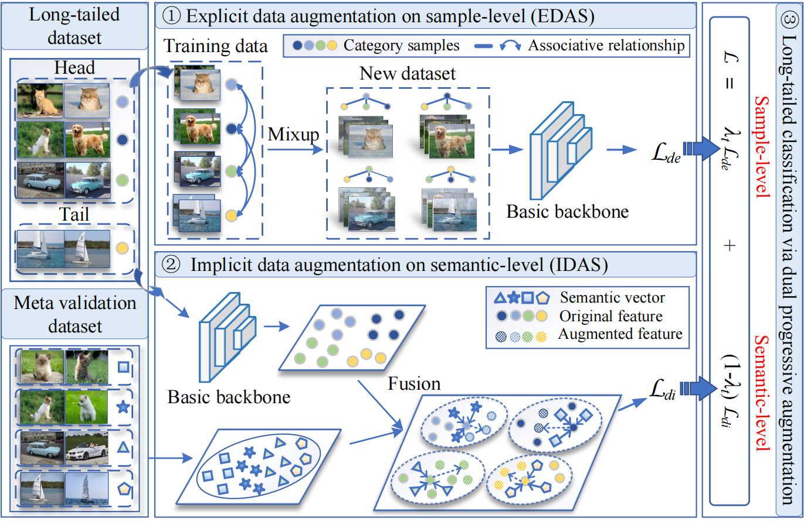

## DPA-EI: Long-tailed classification by dual progressive augmentation from explicit and implicit perspectives



## 1.training

### (1) CIFAR10-LT 
#### Training
* run such as resnet32 200 epochs:
```
python cifar_train.py --dataset cifar10 --num_classes 10 --num_meta 10 --batch-size 100 --imb_factor 0.01 --test-batch-size 100 --epochs 200 --lr 0.1 --momentum 0.9 --weight-decay 5e-4 --gpu 0 --idx '0'
```

### (2) CIFAR100-LT 
#### Training
* run such as resnet32 200 epochs:
```
python cifar_train.py --dataset cifar100 --num_classes 100 --num_meta 100 --batch-size 100 --imb_factor 0.01 --test-batch-size 100 --epochs 200 --lr 0.1 --momentum 0.9 --weight-decay 5e-4 --gpu 0 --idx '0'
```


### (3) ImageNet-LT
#### Training
* run such as resnet50 90 epochs:
```
python train.py --dataset ImageNet_LT --data_root /ImageNet2012 --num_classes 1000 --num_meta 5 --batch-size 64 --epochs 90 --lr 0.0003 --momentum 0.9 --weight-decay 5e-4 --gpu 0 --idx '0'
```


### (4) iNaturalist 2018
#### Training
* run such as resnet50 180 epochs:
```
python train.py --dataset iNaturalist18 --data_root /iNaturalist18 --num_classes 8142 --num_meta 2 --batch-size 64 --epochs 180 --lr 0.0003 --momentum 0.9 --weight-decay 5e-4 --gpu 0 --idx '0'
```


## 2. Prerequisite

- PyTorch >= 1.2.0
- Python3.8
- torchvision
- PIL
- argparse
- numpy


## 3. Datasets
### (1) Four bechmark datasets 
* Please download these datasets and put them to the /data file.
* CIFAR-10/100 will be downloaded automatically with the dataloader.
* ImageNet-LT can be found at [here](https://drive.google.com/drive/u/1/folders/1j7Nkfe6ZhzKFXePHdsseeeGI877Xu1yf).
* iNaturalist data should be the 2018 version from [here](https://github.com/visipedia/inat_comp).

```
data
├── CIFAR10
│   └── cifar-10-python
├── CIFAR100
│   └── cifar-100-python
├── ImageNet_LT
│   ├── test
│   ├── train
│   └── val
└── iNaturalist 
    ├── test2018
    └── train_val2018
```

### (2) Txt files
* We provide txt files for test-agnostic long-tailed recognition for ImageNet-LT, Places-LT and iNaturalist 2018. CIFAR-100 will be generated automatically with the code.
* For iNaturalist 2018, please unzip the iNaturalist_train.zip.
```
data
├── ImageNet_LT
│   ├── ImageNet_LT_test.txt
│   ├── ImageNet_LT_train.txt
│   └── ImageNet_LT_val.txt
│ 
└── iNaturalist18
    ├── iNaturalist18_train.txt
    └── iNaturalist18_val.txt 
```

